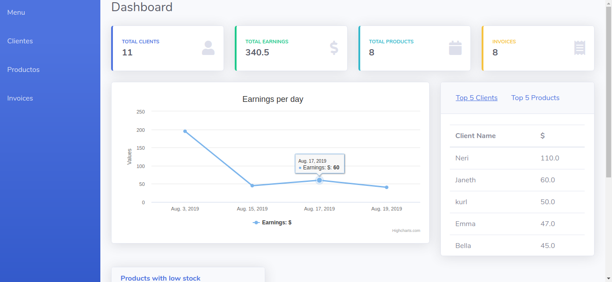
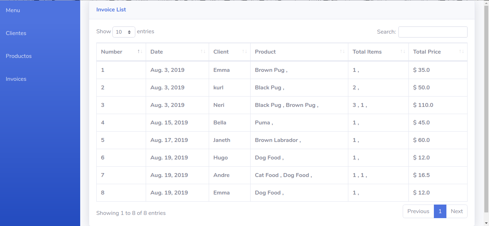

 # Django Ecommerce App
 
 Small and basic Ecommerce project (under construction).
 
 The app was constructed with a boostrap template, it consist of a Menu with interactive links directing to dahsboard/menu, products, clients and invoices template. 
 
 The dashboard displays informative cards, charts and a graphic showing the total sales.
 
 ## The App was built with: 
 Django, Python3, HTML, CSS, SQLITE, Bootstrap, JavaScript.
 
 
 
 
 
 
 
 
 
